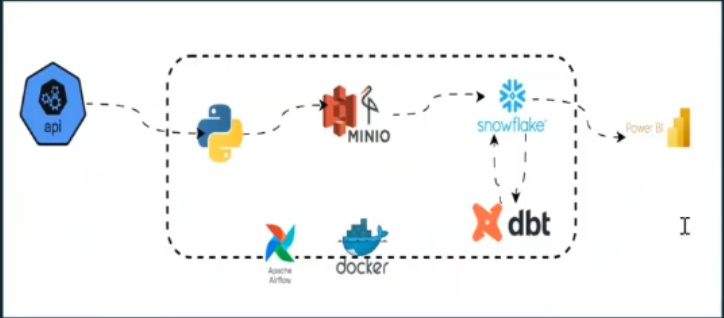

# triplens-country-insights-platform
A scalable, cloud-native data engineering platform that aggregates and transforms global country data into actionable travel insights using Python, Airflow, MinIO, Snowflake, DBT, and Power BI.
Triplens-country-insights-platform is a production-grade data engineering platform designed to transform publicly available country data into structured, analytics-ready travel intelligence.The platform enables tourists and travellers to access key country insights such as regions, languages, currencies, time zones, neighbouring countries, and travel trends through intuitive dashboards.

# Key Features
End-to-end data pipeline architecture (API → MinIO → Snowflake → Power BI)
Automated data ingestion and orchestration using Apache Airflow
Scalable data storage with S3-compatible MinIO
Advanced data transformation using DBT
Cloud-native data warehousing with Snowflake
Interactive Power BI dashboards for travel analytics
Containerized deployment using Docker
# Business Value
Consolidates fragmented country data into a single source of truth
Enables fast, data-driven travel decisions
Ensures data integrity, scalability, and accessibility
Provides real-time insights for tourism planning and exploration
# Architecture Overview

This project implements a modern data pipeline:
API ingestion via Python
Orchestration with Airflow
Object storage using MinIO
Transformation with DBT
Warehousing in Snowflake
Visualization in Power BI
# Use Case
Designed for:
Travellers and tourists
Travel agencies
Data-driven destination planning platforms